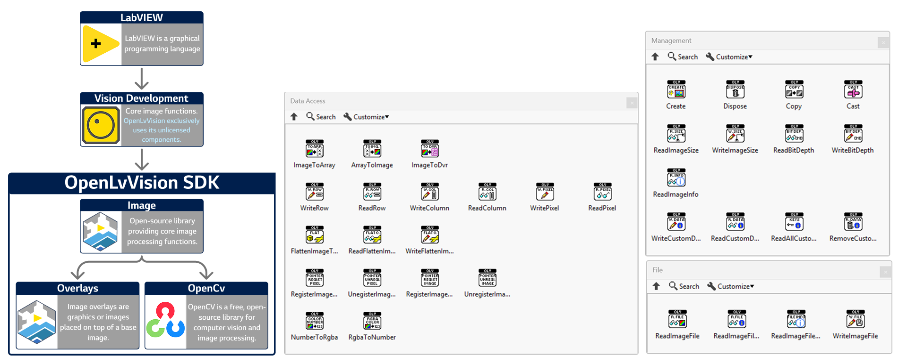

# OpenLvVision  

**OpenLvVision** is an open-source library designed for image processing within the LabVIEW environment. It bridges the gap between high-level Vision steps and low-level memory management, offering granular control over image data.

📘 **Documentation**: For a complete reference of all functions and detailed usage, visit **[openlvvision.org/docs/image/](https://openlvvision.org/docs/image/)**.

---

## 🔎 Data Access

* **Array Conversions**: Rapidly convert between LabVIEW Arrays (1D/2D/3D) and Vision Images.
    * *Supported Types*: `U8`, `U16`, `I16`, `U32`, `U64`, `SGL`, `Complex (CSG)`, and `RGB (U32/U64)`.
    * *Functions*: `Image To Array`, `Array To Image`.
* **Direct Pixel Manipulation**: Read and write specific pixels, rows, or columns without extracting the entire image.
    * *Functions*: `Read/Write Pixel`, `Read/Write Row`, `Read/Write Column`.
* **Zero-Copy Access (DVR)**: Utilize **Data Value References** to manipulate image data in-place for maximum speed.
    * *Functions*: `Image To DVR`.
* **Utilities**:
    * `Flatten Image To String` (with compression options).
    * `Number To Color` / `Color To Number` (Convert between integer and RGBA structures).

## 📁 File Input/Output

Robust tools for handling standard image files and web-ready data formats.

* **Standard Formats**: Read and write common formats including **BMP**, **JPEG**, **PNG**, **TIFF**, and **JPEG2000**.
    * *Functions*: `Read Image File`, `Write Image File` (Polymorphic).
* **Web Integration**: Easily convert images for web applications or APIs.
    * *Functions*: `String To Base64`, `Get File String` (Retrieve raw file bytes without saving to disk).

## 🛠 Management & Utilities

Essential tools for managing the lifecycle and metadata of your images.

* **Lifecycle Control**: Safely manage image memory.
    * *Functions*: `Create`, `Dispose`, `Copy`, `Cast` (Convert Image Types).
* **Metadata & Info**: Access and modify hidden image properties.
    * *Functions*: `Read/Write Image Size`, `Read/Write Bit Depth`, `Read Image Info`.
* **Custom Data**: Attach custom key-value pairs directly to an image reference.
    * *Functions*: `Read/Write Custom Data`, `Remove Custom Data`, `Read All Custom Keys`.

---

## System Requirements
* **LabVIEW**: 2020 or newer (Community Edition supported).
* **OS**: Windows operating system.
* **Dependencies**: NI Vision Development/Runtime Module (No License required).

## Installation
Install the **OpenLvVision_Image** package directly via [VI Package Manager (VIPM)](https://www.vipm.io/package/openlvvision_lib_openlvvision_image/).

## License
**OpenLvVision** is open-source software BSD-3. 

**Third Party Copyrights:**
* © 2000–2026 National Instruments Corporation. All rights reserved.
* Third-party copyrights are property of their respective owners.
